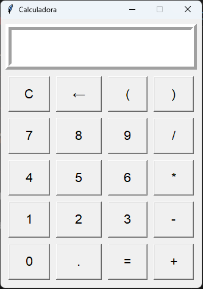

# 🧮 Calculadora em Python (Tkinter)

## 📷 Screenshot

Este projeto é uma calculadora simples desenvolvida em Python utilizando a biblioteca Tkinter para interface gráfica.

A ideia foi praticar:

- Programação Orientada a Objetos (POO)
- Manipulação de eventos
- Organização de layout com grid
- Tratamento de entrada do teclado
- Validação básica de expressões matemáticas

Estou construindo este projeto como parte do meu processo de evolução em Python e desenvolvimento backend.

---

## 🚀 Funcionalidades

✔ Operações básicas: +  -  *  /  
✔ Suporte a parênteses  
✔ Botão **C** para limpar tudo  
✔ Botão **←** para apagar último caractere  
✔ Suporte ao teclado:
- Enter → calcular
- Backspace → apagar
- Esc → limpar
- Números e operadores permitidos

---

## 🛠 Tecnologias Utilizadas

- Python 3
- Tkinter (interface gráfica)

---

## 📂 Estrutura do Projeto

